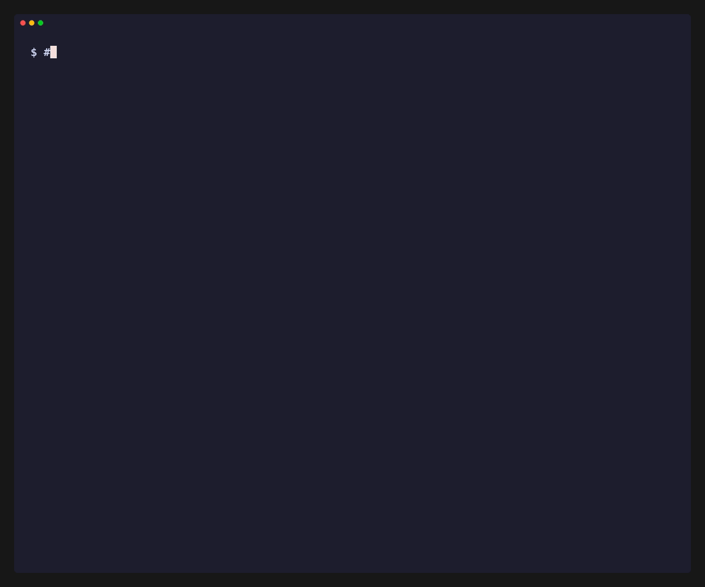

# claude_stream_viewer

Pretty-prints [Claude Code](https://claude.com/claude-code) `stream-json` events from stdin with colorized output. Drop it at the end of a `claude --output-format stream-json` pipe to read the stream as a human instead of as raw JSON.

[](https://www.npmjs.com/package/claude_stream_viewer)
[](https://www.npmjs.com/package/claude_stream_viewer)
[](LICENSE)



## Requirements

- Node.js 20+
- An upstream process emitting [Claude Code stream-json events](https://docs.claude.com/en/docs/claude-code/sdk) (typically the `claude` CLI run with `--output-format stream-json`)


## Install

```bash
npm install -g claude_stream_viewer
# or run on demand without installing
npx -y claude_stream_viewer@latest
```

## Usage

Pipe any source of stream-json events into the viewer:

```bash
claude --output-format stream-json --verbose \
       --permission-mode auto -p "explain quantum computing like I'm 5" \
  | npx -y claude_stream_viewer@latest
```

The viewer reads one JSON event per line from stdin and writes a colorized, human-readable rendering to stdout. It exits when stdin closes, printing `[stream ended]`.

### What it renders

The viewer consumes Claude Code's **consolidated event layer** (`system`, `assistant`, `user`, `rate_limit_event`, `result`). The fine-grained `stream_event` SSE envelopes are ignored — the consolidated events already carry fully assembled content blocks.

| Event              | Output                                                                              |
|--------------------|-------------------------------------------------------------------------------------|
| `system` (`init`)  | `=== SESSION ===` header with model, cwd, tool count, session id, claude-code version |
| `assistant`        | One block per content type: `--- thinking ---`, plain assistant text, or `→ <tool>` with a per-tool compact body (Bash → `$ <command>`, Read/Write/Edit → file path, Grep/Glob → pattern, TodoWrite → checkbox list, etc.). Unknown tools fall back to a JSON dump. |
| `user`             | `← <tool> result` (or `← <tool> ERROR`) followed by the tool output, truncated past 40 lines |
| `rate_limit_event` | One-line `[rate_limit] <status>` notice                                             |
| `result`           | `=== RESULT ===` summary with terminal_reason, stop_reason, turns, duration, cost (full token/latency/tool stats via `--stats`) |
| `stream_event`     | Silently skipped                                                                    |
| Anything else      | `=== <type> ===` header followed by the raw JSON                                    |

Tool calls and their results are paired by `tool_use_id`, so each `← <tool> result` is labeled with the matching call's tool name.

Malformed lines are reported on stderr (`Invalid JSON: …`) without aborting the stream.

## Stats summary

Pass `--stats` (`-s`) to suppress the streamed log and print **only** an end-of-stream summary, computed from the `result` event:

```bash
cat session.jsonl | npx -y claude_stream_viewer@latest --stats
```

It reports:

- **RESULT** — terminal_reason, stop_reason, turns, duration, cost, and health signals (is_error, permission_denials)
- **LATENCY** — wall vs API vs local (tools + overhead) split, plus output throughput
- **TOKENS** — input / output / cache read / cache create / total, cache-hit %, and a per-model breakdown with per-model cost
- **CONTEXT** — peak prompt size and % of the context window used at peak
- **TOOLS** — call count per tool and tool-result error rate

Choose the output format with `--json` or `--markdown` (both imply `--stats`):

```bash
cat session.jsonl | npx -y claude_stream_viewer@latest --json | jq .tokens
cat session.jsonl | npx -y claude_stream_viewer@latest --markdown
```

Truncated streams (no `result` event) still print CONTEXT and TOOLS from what was observed, with a "stream truncated" note.

## Options

| Flag          | Description                                              | Default |
|---------------|---------------------------------------------------------|---------|
| `-s, --stats` | Print only the summary stats; suppress the streamed log | off     |
| `--json`      | Output stats as JSON (implies `--stats`)                | —       |
| `--markdown`  | Output stats as Markdown (implies `--stats`)            | —       |
| `--no-color`  | Disable colored output                                  | colored |
| `--version`   | Print the package version                               | —       |
| `--help`      | Print usage help                                        | —       |

## Development

```bash
cd packages/claude_stream_viewer
npm install
npm run dev        # tsx ./src/cli.ts
npm run build      # compile TypeScript → dist/
npm run typecheck  # type-check without emitting
```

## Output

- Rendered events are written to **stdout**.
- Parse errors and processing errors are written to **stderr**; the process keeps reading.
